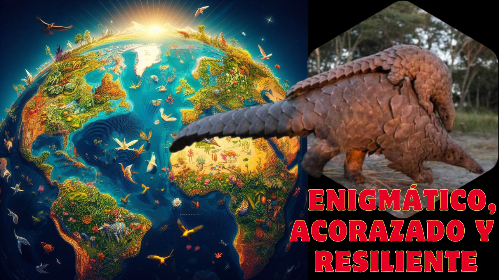

## 🐜 Pangolín: ¡La máquina devoradora de 70 millones de hormigas! 🍽️

Imagina al animal más enigmático de los bosques tropicales de África y Asia: una criatura que parece un cruce entre un armadillo y una alcachofa andante. 

Es el único mamífero cubierto por una armadura completa. Pero, ¿qué sabes realmente de este ser solitario y nocturno? Acompáñanos para descubrir a este superviviente con ochenta millones de años de historia evolutiva, cuya biología única es tan fascinante como las amenazas que lo han convertido en el mamífero más traficado del planeta. Hoy revelaremos los secretos del pangolín, miembro del orden Pholidota, un animal cuya defensa extraordinaria y papel en la salud global te sorprenderán.

El pangolín es el único mamífero con escamas verdaderas. Su nombre proviene del malayo “peng-goling”, que significa “el que se enrolla”, describiendo su estrategia defensiva: cuando se siente amenazado, se acurruca formando una bola perfecta, mostrando solo sus placas protectoras. Estas escamas, dispuestas como tejas, están hechas de queratina, la misma proteína que compone nuestras uñas y el pelo. Su coraza es tan resistente que puede soportar ataques de hienas y grandes felinos. Además, cuenta con un recurso extra: las escamas afiladas de su cola, que puede usar para golpear, y la capacidad de liberar un olor penetrante desde sus glándulas anales, similar al mecanismo de los zorrillos.

Los pangolines son insectívoros estrictos, especializados en devorar hormigas y termitas. Su olfato, extremadamente sensible, les permite localizar colonias con precisión. Para alimentarse, despliegan una lengua pegajosa y descomunal, que puede medir hasta cuarenta centímetros fuera de la boca o sesenta centímetros en total. Con sus garras poderosas, excavan el suelo o desgarran la corteza de los árboles, introduciendo su lengua para atrapar insectos. Curiosamente, carecen de dientes. En su lugar, poseen un estómago musculoso que, junto con pequeñas piedras gástricas que ingieren, tritura los exoesqueletos de sus presas. Su apetito es voraz: un solo pangolín puede consumir doscientas mil hormigas al día, más de setenta millones al año, convirtiéndose en un aliado natural de los agricultores al controlar plagas y airear la tierra.

Existen ocho especies de pangolines repartidas en dos continentes. Cuatro viven en África, desde Sudán y Senegal hasta Sudáfrica, en sabanas, bosques y zonas semidesérticas. Las otras cuatro habitan Asia, desde Pakistán hasta Borneo, en bosques tropicales densos. Su reproducción es lenta: la mayoría tiene una cría por año, aunque las asiáticas pueden tener hasta tres. La gestación dura entre setenta y ciento cincuenta días. Las crías nacen con escamas blandas que se endurecen rápidamente, y la madre las transporta sobre la base de su cola, mostrando un cuidado excepcional.

El pangolín ostenta un triste récord: es el mamífero más traficado del mundo. Más de un millón han sido capturados para el comercio ilegal, impulsado por la demanda en Asia, donde su carne se considera un manjar y sus escamas se usan en medicina tradicional para tratar dolencias como asma o reumatismo. El pangolín también saltó a la fama por su posible vínculo con el COVID-19 como reservorio del virus, junto con los murciélagos. Este hecho subraya el riesgo del tráfico ilegal de fauna, que facilita enfermedades zoonóticas. Paradójicamente, el pangolín muestra resistencia al COVID-19 gracias a adaptaciones genéticas que reducen el daño viral.

Proteger al pangolín requiere acciones urgentes: combatir el tráfico, restaurar hábitats y educar a las comunidades sobre su valor ecológico. Este guerrero acorazado no solo es un símbolo de la biodiversidad, sino también un aliado silencioso en el equilibrio de los ecosistemas.
