| Tema                                              | Encuesta  |Short  | Seleccionado  | Video                               | Source    |Img|
|--------------                                     |---------- |------ |-------------- |-------                              |--------   |----|
| Abejaruco Esmeralda                               |           |       |               |                                     |           ||
| Abejas                                            | OK        |       | OK            |[Aleteos de Vida: 🐝 Explorando el Reino de las Abejas 🌼](https://youtu.be/3-UQtx3RCeo) |           ||
| Abejorro                                          |           |       |               |                                     |           ||
| Acara azul eléctrico                              |           |       |               |                                     |           ||
| Aguila real                                       | OK        |       | OK            |[Aguila real ‐ imponente, majestuosa y poderosa](https://youtu.be/TvznRVD1Kdw) |           ||
| Ajolote                                           | OK        |       | OK            |[🐉🐸💧Axolote : Fascinante y en peligro](https://youtu.be/7YtiIV7lYsA) |           ||
| Albatros                                          |           |       |               |                                     |           ||
| Alce                                              | OK        |       | OK            |[🦙El Alce: Gigante de los Bosques🌲](https://youtu.be/X7IdEqA89Gw) |           ||
| Almeja gigante                                    |           |       |               |                                     |           ||
| [Anguila eléctrica](../fauna/anguila_electrica/guion_01.md)|OK(1) | 7 | 16/03/2025    |[⚡🔥 ¡Este pez genera 860 voltios! ¿Cómo lo hace? 🤯](https://youtu.be/gNh4uz7z7II)|           ||
| Anguila morena                                    |           |       |               |                                     |           ||
| Antílope                                          |           |       |               |                                     |           ||
| Arana viuda negra                                 | OK        |  OK   | OK            |[Araña viuda negra, venenosa, sigilosa y peligrosa](https://youtu.be/7brFhGQ8pJ4) |           ||
| Ardilla                                           | 1         |       |               | |           ||
| Armadillo                                         | 1         |  8    |26/01/2025     |[🛡️🛡️ Armadura natural ⚠️⚠️](https://youtu.be/RZtqaQs1NaM)|[info](https://mexico.inaturalist.org/taxa/47075-Dasypus-novemcinctus)||
| Atun rojo                                         | 1         |       |               |                                     |           |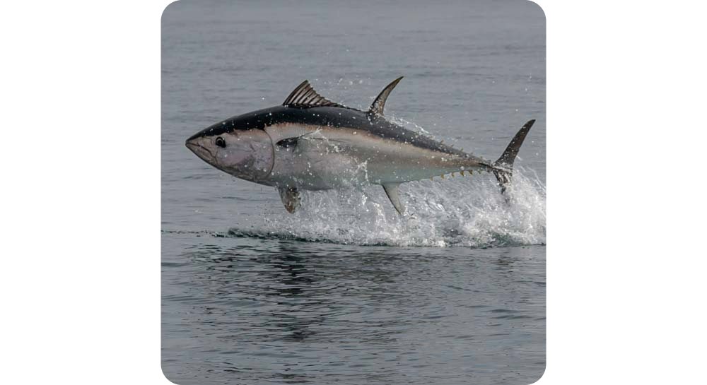|
| Armiño                                            | 1         |       |               |                                     |           ||
| Ascidias                                          |           |       |               |                                     |           ||
| Ave del paraíso                                   |           |       |               |                                     |           ||
| Avestruz                                          |           |  OK   | OK            |[No, no vuela](https://youtu.be/3HRBk2X-pvQ)                                     |           ||
| Avispa                                            |           |       |               |                                     |[info](http://www.avispapedia.com/)||
| Avispón asiático gigante                          |           |       |               |                                     |           ||
| Avoceta                                           | 1         |       |               |                                     |           |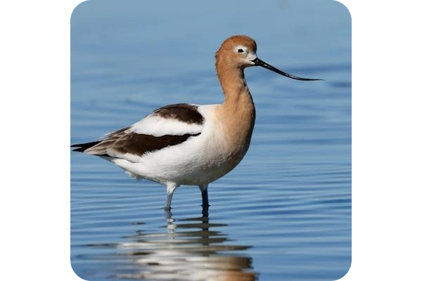|
| Babosa de mar                                     |           |       |               |                                     |           ||
| Babuino                                           | 1         |       |               |                                     |           ||
| Ballena azul                                      |           |  OK   | OK            |[Grande no, el más grande](https://youtu.be/I7tZo5470ks) |           ||
| Barbo                                             |           |       |               |                                     |           ||
| Barracuda                                         |           |       |               |                                     |           ||
| Bigotudo(Panurus biarmicus)                       |           |       |               |                                     |           ||
| Bisonte                                           |           | WAIT  | OK            |[Imponente, peludo y salvaje](https://youtu.be/CR0eYiFuvLo) |           ||
| Boa de Duméril                                    |           |       |               |                                     |           ||
| Bongo oriental                                    |           |       |               |                                     |           ||
| Buey almizclero                                   |           |  18   | OK (SHORT)    |[Descubriendo al 🐂 Buey Almizclero: Misterios de la Naturaleza 🏔️](https://youtu.be/Ts_GWytS9Ug) |           ||
| Bufalo rojo                                       |           |       |               |                                     |           ||
| Búfalo                                            | 1         |       |               |                                     |[info](https://animalia.bio/es/bubalus)||
| Búhos (genero)                                    | 1         |   7   |02/01/2025|[🦉 Búhos: los depredadores nocturnos🌙](https://youtu.be/DgzzFdvD_N0)|[info](http://www.buhopedia.com/)|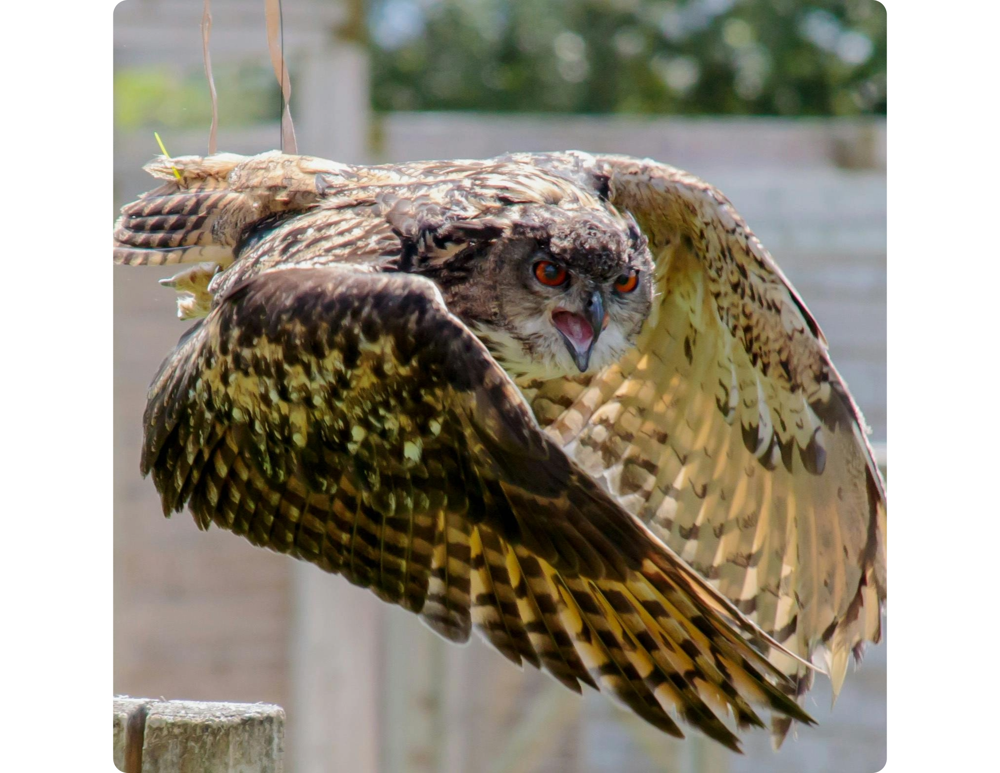|
| Búho chico                                        |           |       |               |                                     |           ||
| Búho nival                                        |           |       |               |                                     |           ||
| Buitre leonado                                    |           |  WAIT | OK            |[🦅🌄El Buitre Leonado: Majestuoso Guardián de los Cielos🌄🦅](https://youtu.be/NBkANB5ClDE) |           ||
| Burro                                             |           |       |               |                                     |           ||
| Busardo ratonero                                  |           |       |               |                                     |           ||
| Caballito de mar                                  | 1         |   8   |09/02/2025|[🦐 ¡El pez que desafía la naturaleza! ¿Sabías que el macho da a luz? 🤯](https://youtu.be/lC2IIldc4qM)||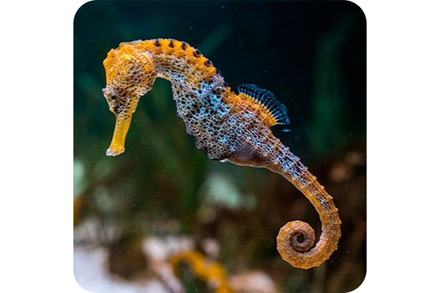|
| Caballo                                           |           |  WAIT | OK            |[🏇🌟 La Elegancia y Fuerza del Caballo 🐴](https://youtu.be/Wrh2OyZrXzw) |[info](http://www.caballopedia.com/)||
| Caiman                                            | 1         |       |               |                                     |           ||
| Cabra                                             | 1         |       |               |                                     |           |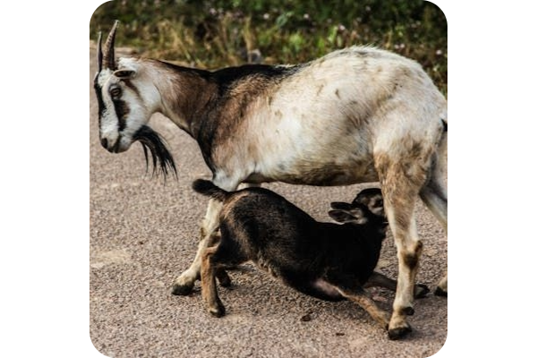|
| Cachalote                                         | 1         |       |               |                                     |           |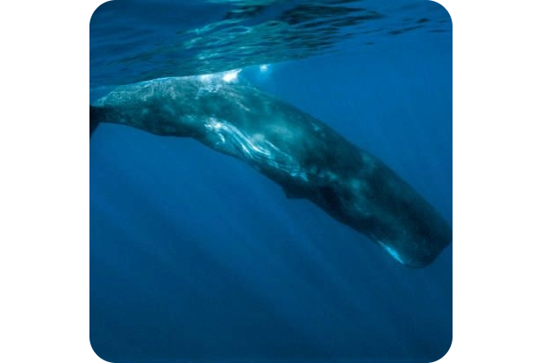|
| Caimán                                            |           |       |               |                                     |           ||                   
| Calamar                                           |           | 1     |               |                                     |[info](http://www.calamarpedia.com/)||
| Camaleón                                          |           |       |               |                                     |           ||
| Camaleón pantera                                  | OK        |       | OK (SHORT)    |[🦎 Maestro del Camuflaje 🦎](https://youtu.be/O-vIhrfStrc) |           ||
| Camarón                                           | 1         |       |               |                                     |           |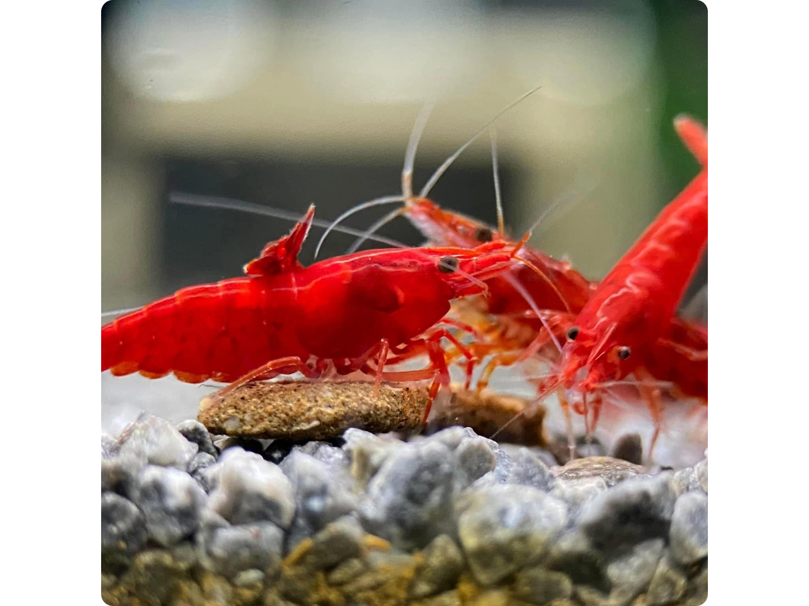|
| Camelus bactrianus:camello bactriano doméstico    | 1         |  6    |19/01/2025|    [🐫🐫 Desafía los Extremos 🐫🐫](https://youtu.be/RrW0lusN_NE)|[Camelus bactrianus:camello bactriano doméstico](https://es.wikipedia.org/wiki/Camelus)||
| Camelus dromedarius: el dromedario                |           |       |               |                                     |[Camelus dromedarius: el dromedario o camello arábigo, el cual posee una sola joroba](https://es.wikipedia.org/wiki/Camelus)||
| Camelus ferus:camelloBactrianoSalvaje             |           |       |               |                                     |[Camelus ferus: el camello salvaje o camello bactriano salvaje, el único que nunca fue domesticado](https://es.wikipedia.org/wiki/Camelus)||
| Cangrejo                                          | 1         |       |               |                                     |           ||
| Cangrejo herradura                                |           |       |               |                                     |           ||
| Canguro                                           | OK(2)     |  6    |24/02/2025     |[🦘 ¡El verdadero maestro del salto! 🚀](https://youtu.be/AaMz7okGyGM)|[info](http://www.canguropedia.com/)|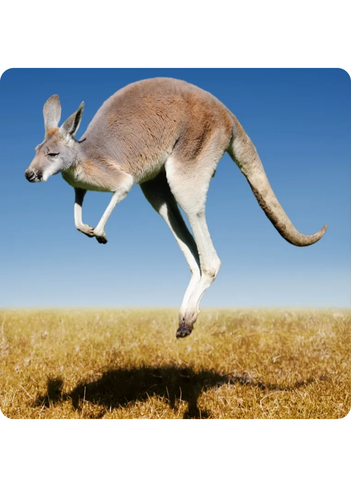|
| Capibara                                          |           | 6     | OK            |[🌿El Roedor Más Grande🐾](https://youtu.be/62pcn8KlXec)|           ||
| Cárabo común                                      |           |       |               |                                     |           ||
| Caracal                                           |           |       |               |                                     |           ||
| Caracol                                           |           |       |               |                                     |[info](http://www.caracolpedia.com/)||
| Castor                                            |           | 9     | OK            |[🏗️Castores: Arquitectos Acuáticos y Sus Increíbles Presas🏞️](https://youtu.be/xAsoxYUc_UA)|||
| Casuario                                          | 1         |       | OK (SHORT)    |[🦕El Ave Más Peligrosa del Mundo🦕](https://youtu.be/0_kwLA4VkUs) |           ||
| Cebra                                             |           |       |               |[🦓✨ Descubre los Secretos de las Cebras: ¡Más que Rayas!](https://youtu.be/YK9GXfO3oQc)| ||
| Cebú                                              |           |       |               |                                     |           ||
| Centzontle Norteño(MimusPolyglottos)              |           |       |               |                                     |           ||
| Cerdo                                             |           |       |               |                                     |           ||
| Cerdo hormiguero                                  |           |       |               |                                     |           ||
| Cetia japonés                                     |           |       |               |                                     |           ||
| Chacal                                            | 1         |       |               |                                     |           ||
| Chimpancé                                         |           |       |               |                                     |[info](http://www.chimpancepedia.com/)||
| Chinchilla                                        | 1         |       |               |                                     |[info 1](https://exoticsveterinaria.com/especies/roedores/chinchilla/)||
| Cíclido                                           |           |       |               |                                     |           ||
| Ciempiés                                          |           |       |               |                                     |           ||
| Ciervo                                            |           |       |               |[🌿🦌 Entre Cuernos y Bosques: La Belleza Salvaje de los Ciervos 🦌🌿](https://youtu.be/6MR2odQQbeE)                                     |           ||
| Cigüeña                                           | 1         |       |               |                                     |           |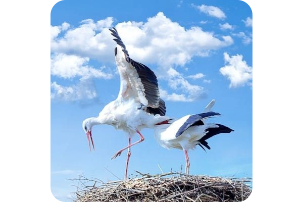|
| Cisne                                             | 1         |       | OK (SHORT)    |[🦢Elegancia y Feroz Defensor💪 de su Familia🐣](https://youtu.be/iaEjZ789Tjc) |           ||
| Civeta africana                                   | 1         |       |               |                                     |           |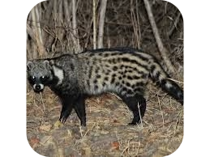|
| Civeta de las palmeras común                      |           |       |               |                                     |           ||
| Civeta malaya                                     |           |       |               |                                     |           ||
| Coatí de cola anillada                            |           |       |               |                                     |           ||
| Cobaya                                            |           |       |               |                                     |           ||
| Cochinilla de la humedad                          |           |       |               |                                     |           ||
| Cocodrilo                                         |           |       |               |[🎯El Depredador que Nunca Cambió 🐊](https://youtu.be/eyTdJxysv4k)|[info](http://www.cocodrilopedia.com/)||
| Codorniz común                                    |           |       |               |                                     |           ||
| Colimbo grande                                    |           |       |               |                                     |           ||
| Colibri                                           |           |       |               |[🌺Magia en Miniatura🐦](https://youtu.be/1k5i5PG5Z_Q)|           ||
|                                                   |           |       |               |[version 1](https://youtu.be/THKRiTspxp4)|           ||
| Comadreja                                         | 1         |       |               |                                     |           ||
| Conejo                                            |           |       |               |                                     |           ||
| Coral                                             |           |       |               |                                     |           ||
| Coyote                                            | 1         |       |               |                                     |           ||
| Cucaracha                                         |           |       |               |                                     |           ||
| Demonio de Tasmania                               |           |       |               |                                     |           ||
| Delfin                                            |           | WAIT  | OK            |[🐬 El Encanto Oculto de los Delfines: 🌊Secretos del Mar](https://youtu.be/F6-9Cc0kihY) |[info](http://www.delfinpedia.com/)||
| Dik-dik de Kirk                                   |           |       |               |                                     |           ||
| Dientes de sable                                  |           |       |               |                                     |           ||
| Dingo                                             |           |       |               |                                     |           ||
| Dodo (extinta)                                    |           |       |               |                                     |           ||
| Dólar de plata                                    |           |       |               |                                     |           ||
| Dragón de agua asiático                           |           |       |               |                                     |           ||
| Dragón de agua australiano                        |           |       |               |                                     |           ||
| Dragón de komodo                                  |           |       | OK (SHORT)    |[Dragón de Komodo formidable, sigiloso y carnívoro](https://youtu.be/Hvmolz0AxnQ) |           ||
| Dragón de mar foliáceo                            |           |       |               |                                     |           ||
| Dugongo                                           | 1         |       |               |                                     |           ||
| Elefante                                          |           | WAIT  | OK            |[Descubriendo al Elefante](https://youtu.be/4ZbgP7tGWzI) |[info](http://www.elefantepedia.com/)||
| Emperador púrpura                                 |           |       |               |                                     |           ||
| Emú común                                         |           |       |               |                                     |           ||
| Erizo                                             | 1         |       |               |                                     |           ||
| Erizo de mar                                      |           |       |               |                                     |           ||
| Escarabajo                                        |           |       |               |                                     |           ||
| Escorpión                                         | 1         |       | OK (SHORT)    |[🦂 Veneno y Resiliencia 🦂](https://youtu.be/jRe5lijgXWo) |[info](http://www.escorpionpedia.com/)||
| Escorpión emperador                               |           |       |               |                                     |           ||
| Espátula rosada                                   |           |       |               |                                     |           ||
| Esponjas de mar                                   |           |       |               |                                     |           ||
| Estrella de mar                                   | 1         |       |               |                                     |           |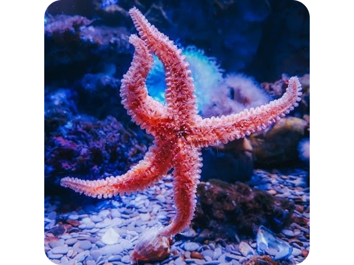|
| Estornino                                         |           | WAIT  | OK            |[✨El Vuelo Sincrónico 🌌: Explorando el Mundo de los Estorninos 🐦](https://youtu.be/bf9hFIpF-4o) |           ||
| Facóquero común                                   |           |       |               |                                     |[info](https://www.naturalista.uy/taxa/42122-Phacochoerus-africanus)|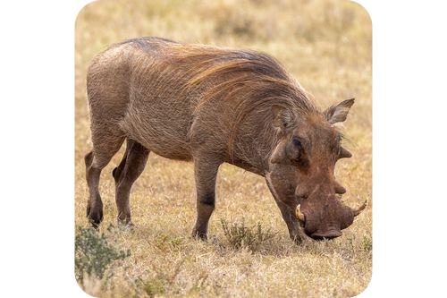|
| Faetón                                            | 1         |       |               |                                     |           ||
| Faisán                                            | 2         |       |               |                                     |[info](https://www.naturalista.uy/taxa/981-Phasianus-colchicus)||
| Flamenco                                          | 1         |       |               |                                     |[info](http://www.flamencopedia.com/)||
| Foca                                              |           |       |               |                                     |[info](http://www.focapedia.com/)||
| Foca leopardo                                     |           | WAIT  | OK            |[🗺️🔍 Explorando el Reino Helado🌬️ Encuentro con la Foca Leopardo](https://youtu.be/Asd3inTh4RM) |  ||
| Fosa                                              |           |       |               |                                     |           ||
| Frailecillo común                                 |           |       |               |                                     |           ||
| Fregata                                           | 1         |       | OK (SHORT)    |[🦃El ave con la bolsa gular roja🦃](https://youtu.be/617T4fW5KF0) |           ||
| Gacela                                            |           | WAIT  | OK            |[La elegancia y rapidez de la gacela](https://youtu.be/CApPwBXdPJE) |           ||
|                                                   |           |       |               |[version 1](https://youtu.be/-m4epA39-cs) |           ||
| Gallina de Guinea                                 |           |       |               |                                     |           ||
| Gallineta común                                   |           |       |               |                                     |           ||
| Gamba                                             |           |       |               |                                     |           ||
| Ganso                                             |           |       |               |                                     |           ||
| Ganso del Nilo                                    |           |       |               |                                     |           ||
| Garza                                             | 1         |       | OK (SHORT)    |[🏞️𓅥Depredadores de humedales𓅢🏞️](https://youtu.be/p7tq6LEURfQ) |           ||
| Garza(Garceta Azul)	                            |           |       |               |                                     |[info](ecosdelbosque.com/fauna/egretta-caerulea)||
| Garza(Garceta grande)	                            |           |       |               |                                     |[info](ecosdelbosque.com/fauna/ardea-alba)||
| Garza(Garceta Nivosa)	                            |           |       |               |                                     |[info](ecosdelbosque.com/fauna/egretta-thula)||
| Garza(Garza agami)	                            |           |       |               |                                     |[info](ecosdelbosque.com/fauna/agamia-agami)||
| Garza(Garza bueyera)	                            |           |       |               |                                     |[info](ecosdelbosque.com/fauna/bubulcus-ibis)||
| Garza(Garza del sol)	                            |           |       |               |                                     |[info](ecosdelbosque.com/fauna/eurypyga-helias)||
| Garza(Garza tigre, martín peña)                   |           |       |               |                                     |[info](ecosdelbosque.com/fauna/tigrisoma-fasciatum)||
| Garza(Garza tigre cuellinuda)                     |           |       |               |                                     |[info](ecosdelbosque.com/fauna/tigrisoma-mexicanum)||
| Garza(Garzón azulado o Garza ceniza)              |           |       |               |                                     |[info](ecosdelbosque.com/fauna/ardea-herodias)||
| Gato                                              |           |  WAIT | OK            |[😺 "Secretos de Nuestros Amigos Peludos😻El Fascinante Universo de los Gatos" 🐾](https://youtu.be/NQ4_4MZS2P0) |           ||
| Gato montes                                       |           |  WAIT | OK            |[🌳 Entre Riscos y Bosques🌄: Tras las Huellas🐾 del Gato Montés🐱](https://youtu.be/hfPqhcw_jqI) |           ||
| Gavial                                            |           |       |               |                                     |           ||
| Gecko                                             |           |       |               |                                     |           ||
| Gecko diurno Madagascar                           | 1         |       |               |                                     |           ||
| [Glotón](../fauna/gloton/README.md)|OK(1) | 6 | 23/03/2025    |[🦡 El glotón: El guerrero oculto de la tundra ❄️🐾](https://youtu.be/jAcelyEHJVs)|[info](https://www.naturalista.uy/taxa/41852-Gulo-gulo)|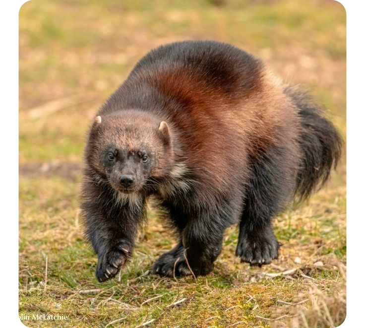|
| Gorila de montaña                                 |           |  WAIT | OK            |[En las huellas del Gorila de Montaña](https://youtu.be/4RsMMwrr5bA) |           ||
| Gorrión                                           | 1         |       |               |                                     |           ||
| Grulla                                            | 1         |       | OK            |[🦩Elegancia y Resistencia en los Cielos🦩](https://youtu.be/w21R6wQSIho) |           ||
| Grulla coronada cuellinegra                       |           |       |               |                                     |           ||
| Guacamayo                                         |           |       | OK            |[Un festín de colores](https://youtu.be/wEwGt2AsmKs) |           ||
| Guepardo                                          |           |       | OK            |[Guepardo ‐ el mamífero terrestre más veloz.](https://youtu.be/6TZvbcYwZ2s) |           ||
| Guppy                                             |           |       |               |                                     |           ||
| Halcón                                            |           |       |               |                                     |           ||
| Halcón peregrino                                  | 1         |       |               |                                     |           ||
| Hámster                                           |           |       |               |                                     |           ||
| Hiena                                             |           |       |               |                                     |           ||
| Hiena manchada                                    |           |  9    | OK            |[🐾Más Allá de su Risa Feroz🦴](https://youtu.be/UCRYiGAlxVM) |           ||
| Hipopótamo                                        |           |       |               |[Descubriendo al Hipopótamo](https://youtu.be/BnFVL8MC8vY)                                     |           ||
| Hormiga                                           | 2         |       |               |                                     |[info](http://www.hormigapedia.com/)||
| Hurón                                             |           |       |               |                                     |           ||
| Ibis                                              | 1         |       |               |                                     |           ||
| Iguana                                            | 1         |       | OK (SHORT)    |[🦎Maestras del Camuflaje y la Supervivencia🦎](https://youtu.be/vRizI7dbWQs) |           ||
| Iguana marina                                     |           |       |               |                                     |           ||
| Impala                                            | 1         |       |               |                                     |           ||
| Indri                                             |           |       |               |                                     |           ||
| Jabalí                                            | 1         |       |               |                                     |           ||
| Jaguar-yaguar-yaguarete                           |           |       |               |[💪 El Poderío del Jaguar 🐆: Rey de la Selva 🌳 y Maestro del Sigilo 🐾](https://youtu.be/xKwvAPWmeuM)| ||
| Jilguero europeo                                  |           |       |               |                                     |           ||
| Jirafa                                            |           |       |               |[La elegancia en las alturas](https://youtu.be/48MdXZ3J8p4)                                     |           ||
| Kakapo                                            |           |       |               |                                     |           ||
| Kiwi                                              | 1         |       |               |                                     |           ||
| Koala                                             |           |       | OK            |[Koala adorable, arborícola y especializado](https://youtu.be/SkrDcDgF1Zg) |           ||
| Labridae                                          |           |       |               |                                     |           ||
| Lagarto                                           |           |       |               |                                     |           ||
| Lagarto caimán del norte                          |           |       |               |                                     |           ||
| Langosta                                          |           |       |               |                                     |           ||
| Lechuza común                                     |           |       |               |                                     |           ||
| Lemur catta                                       |           |       |               |[📚 Lemur Catta👑Curiosidades y Hábitat🌿](https://youtu.be/LzTFS_aL9Dc)|||
| Leon                                              |           |       | OK            |[Es el Rey ???](https://youtu.be/nDimojn4bH8) |           ||
| León marino                                       |           |       |               |                                     |           ||
| Leopardo                                          |           |       | OK            |[Un felino en las alturas](https://youtu.be/TyYOUk9MA5k) |           ||
| Libélula                                          | 1         |       |               |                                     |           ||
| Liebre                                            | 1         |       |               |                                     |           ||
| Lince                                             |           |       | OK            |[Lince sigiloso, elegante y adaptativo](https://youtu.be/w-PeKJTkqS8)                                       |           ||
| Llama                                             |           |       | OK            |[🦙 Llamas: Tesoros de los Altos Andes 🏔️ y Guardianes del Equilibrio Ecológico 🏞️](https://youtu.be/pGB8Laz7GjY)      |           ||
| Lobo blanco                                       |           |       | OK            |[El lobo blanco, majestuoso, adaptado y sigiloso](https://youtu.be/nL2QAobjp4g)                                        |            ||
| Loro                                              |           |       |               |                                     |           ||
| Luchador de Siam                                  |           |       |               |                                     |           ||
| Luciérnaga                                        | 1-OK      |  6    | 03/01/2025    |[ཐི༏ཋྀ💥 Bioluminiscencia en la Noche 💥ཐི༏ཋྀ](https://youtu.be/BrzNMYpMgro) |           ||
| Lucio                                             |           |       |               |                                     |           ||
| Manati                                            |           |       | OK            |[🐚 Secretos del Gigante Gentil: El Fascinante Mundo de los Manatíes 🌱](https://youtu.be/LVKCJec5iUk) |           ||
| Mandril                                           |           |       |               |                                     |           ||
| Mangosta                                          |           |       |               |                                     |           ||
| Mantarraya                                        | 1         |  7    | 13/01/2025    |[𓆰𓆪𓆰𓆪¿Quiénes son los voladores secretos del océano?🌊](https://youtu.be/rW7UUFYgxdA)|[info](http://www.mantarayapedia.com/)||
| Mapache                                           |           |       |               | |           ||
| Mariposa arlequin                                 |           |       |               |                                     |           ||
| Mariposa monarca                                  | 1-OK      |   5   | 09/03/2025    |[🦋 Increíble migración guiada por el sol 🌞](https://youtu.be/hKviXYCHZNQ)|           |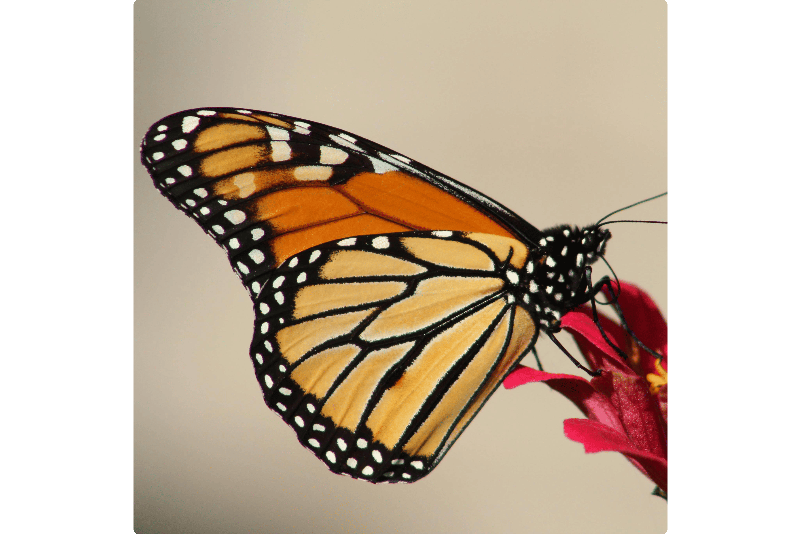|
| Mariposa genero                                   | 1         |       | OK (SHORT)    |[🦋🌼Belleza Alada y Clave de los Ecosistemas🌼🦋](https://youtu.be/dllSt01c_OU) |[info](https://concepto.de/mariposas/)||
| Mariquita                                         |           |       |               |                                     |           ||
| Marmota                                           | 1         |       |               |                                     |           ||
| Martín pescador                                   |           |       |               |                                     |           ||
| Medusa                                            |           |       | OK            |[🔮Las Medusas: Criaturas Mágicas del Mar🦑](https://youtu.be/sLHIu5CIjv8) |[info](http://www.medusapedia.com/)||
| Milpiés                                           |           |       |               |                                     |           ||
| Mirlo común                                       |           |       |               |                                     |           ||
| Mofeta                                            | 1         |       |               |                                     |           ||
| Molly                                             |           |       |               |                                     |           ||
| Mono                                              |           |       |               |                                     |           ||
| Morsa                                             | 1         |       |               ||[info](http://www.morsapedia.com/)||
| Mosca común                                       |           |       |               |                                     |           ||
| Mula                                              |           |       |               |                                     |           ||
| Murciélago                                        |           |       |               | |           ||
| Murciélago vampiro                                |           |       |               |                                     |           ||
| Musaraña                                          |           |       |               |                                     |           ||
| Nu                                                |           |       | OK            |[Ñu herbívoro, veloz y gregario](https://youtu.be/pAXQmnywQQQ) |           ||
| Numbat                                            | 1         |       |               |                                     |           ||
| Nutria                                            |           |       | OK            |[🦦Expertas del Agua🦦](https://youtu.be/mYlgYTaB8yw) |           ||
| Ocelote                                           |           |       | OK            |[🐾 Siguiendo las Huellas del Ocelote: Una Aventura en la Selva 🌿](https://youtu.be/yDARrzaeLpc) |           ||
| Orangután                                         |           |       |               |                                     |           ||
| Orca                                              |           |       | OK            |[🧠💪🌊 Orcas: Inteligencia y Poder en el Mar](https://youtu.be/Eaz9YCf0mBM)|||
| Ornitorinco                                       |           |       | OK            |[🌟La Fascinante Vida del Ornitorrinco: Naturaleza y Curiosidades🤔](https://youtu.be/iqKKGVmqySA) |           ||
| Oropéndola                                        | 1         |       |               |                                     |           ||
| Oruga                                             | 1         |       |               |                                     |           ||
| Oryx                                              |           |       |               |                                     |           ||                       
| Ostra                                             |           |       |               |                                     |           ||
| Oso grizzly                                       |           |       | OK            |[Oso pardo, robusto, peludo y solitario](https://youtu.be/JsDD_Mc7h_w) |           ||
| Oso panda                                         |           |       | OK            |[Oso panda adorable, pacifico y vulnerable](https://youtu.be/W6iL6p3f8ys) |           ||
| Oso polar                                         |           |       | OK            |[Un oso blanco, poderoso y vulnerable](https://youtu.be/w_Ov9KNSV4E) |           ||
| Oveja                                             | 1         |       |               |                                     |           ||
| Pájaro carpintero                                 |           |       |               |                                     |           ||
| Pantera negra (no seria una especie)              |           |       |               |                                     |[info](https://www.publico.es/yo-animal/sabias-que-las-panteras-negras-no-existen/)||
| Pato                                              |           |       |               |                                     |           ||
| pavo doméstico                                    | 1         |       |               |                                     |           ||
| pavo real                                         |           |       |               |                                     |           ||
| Pelícano(genero)                                  | 1         |       | OK (SHORT)    |[𓅬 𓅭 𓅮 𓅯Maestros de los Mares y Cielos💨](https://youtu.be/MPG4eqAEclk) |           ||
| Pelícano comun                                    |           |       |               |                                     |           ||
| Peramélido                                        |           |       |               |                                     |           ||
| Percebe                                           |           |       |               |                                     |           ||
| Perezoso                                          | 2         |       |               |                                     |           |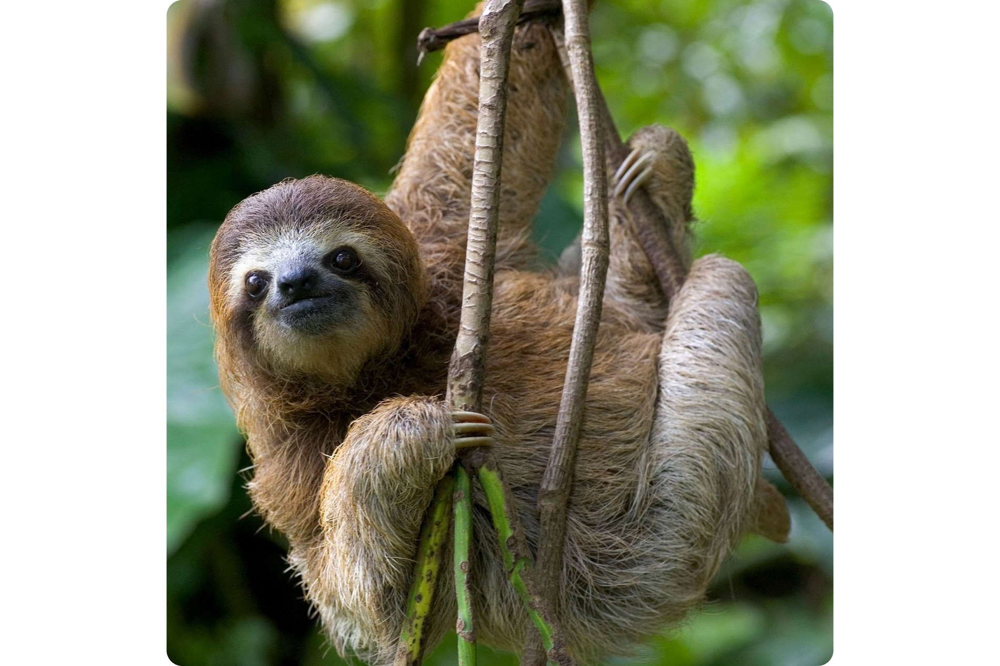|
| Periquito común                                   |           |       |               |                                     |           ||
| Perro                                             |           |       |               |                                     |           ||
| Petirojo europeo                                  | 1         |       |               |                                     |           ||
| Pez Ángel                                         |           |       |               |                                     |           ||
| Pez ballesta payaso                               | 1         |       |               |                                     |[info](https://www.peceswiki.com/pez-ballesta-payaso)||
| Pez cirujano                                      |           |       |               |                                     |           ||
| Pez cofre                                         | 1         |       |               |                                     |[info](https://www.peceswiki.com/pez-cofre)|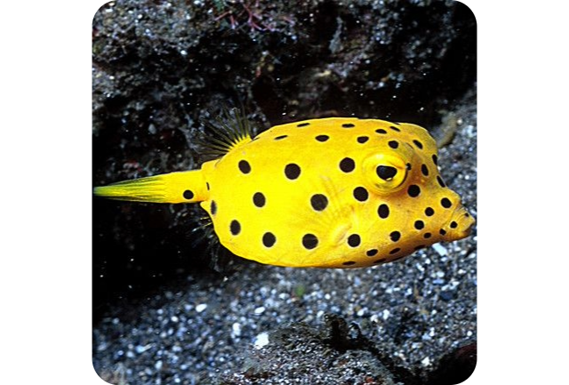|
| Pez disco                                         |           |       |               |                                     |           ||
| Pez gato                                          |           |       |               |                                     |           ||
| Pez globo                                         |           |       |               |                                     |           ||
| Pez león                                          |           |       | OK            |[Intruso Exótico: 🐠🦁 La Amenaza del Pez León 🔥](https://youtu.be/tvQ9hewfxls) |           ||
| Pez luchador                                      | 1         |   6   | 17/02/2025    |[🐠 ¡El pez más feroz y hermoso del acuario! 🔥](https://youtu.be/HpZQCff57ms)|[info](https://www.fishipedia.es/pez/betta-splendens)|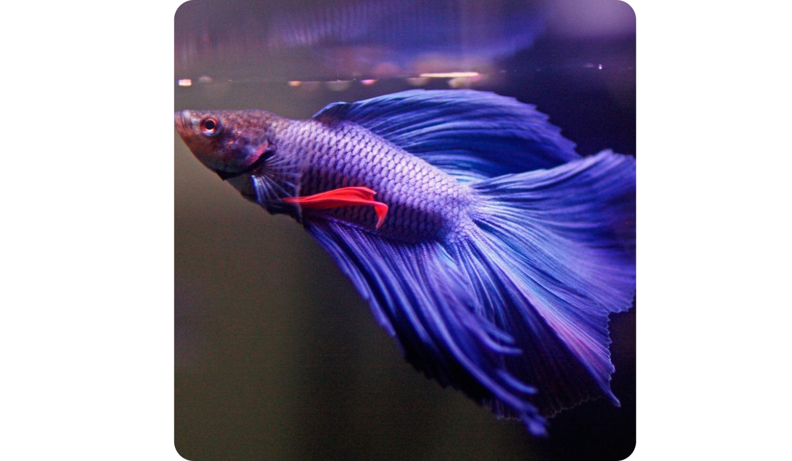|
| Pez mandarin                                      |           |       | OK            |[El pez mandarín colorido, delicado y ornamental](https://youtu.be/lc5iTfC6UeI) |           ||
| Pez mariposa                                      |           |       |               |                                     |           ||
| Pez Payaso                                        |           |       |               |                                     |           ||
| Pingüino                                          | 1         |       |               |                                     |           ||
| Piraña                                            | 1         |       |               |                                     |           ||
| Polilla                                           |           |       |               |                                     |           ||
| Pollo                                             |           |       |               |                                     |           ||
| Proteo                                            |           |       |               |                                     |           ||
| Puercoespín                                       | 1         |       |               |                                     |           ||
| Pulpo                                             | 1         |       |               |                                     |           |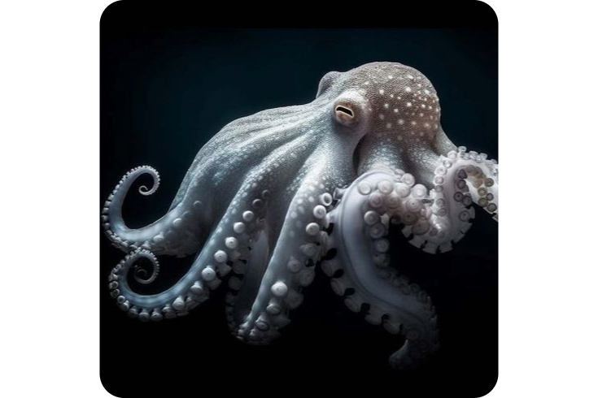|
| Puma                                              |           |       | OK            |[El puma ágil, sigiloso y solitario](https://youtu.be/nQ54wW4Rjac) |           ||
| Quetzal                                           |           |       | OK            |[El quetzal, colorido, elegante y exótico](https://youtu.be/D7zm7St6JN0) |           ||
| Rana africana de uñas                             |           |       |               |                                     |           ||
| Rana cohete rayada                                |           |       |               |                                     |           ||
| Rana comestible                                   |           |       |               |                                     |           ||
| Rana dardo venenosa                               |           |       |               |                                     |           ||
| Rana de Darwin                                    |           |       |               |                                     |           ||
| Rana europea común                                |           |       |               |                                     |           ||
| Rana excavadora                                   |           |       |               |                                     |           ||
| Rana toro                                         |           |       |               |                                     |           ||
| Rana verde centroeuropea                          |           |       |               |                                     |           ||
| Ranas arbóreas (Hayla)                            |           |       |               |                                     |           ||
| Ranita monte Iberia                               |           |       |               |                                     |           ||                       
| Rata                                              | 1         |       |               |                                     |           ||
| Ratón común                                       |           |       |               |                                     |           ||
| Raya                                              |           |       |               |                                     |           ||    
| Reno                                              | 1         |       | OK (SHORT)    |[🦌Un Explorador Ártico🎅🎄❄️☃️🎁🦌](https://youtu.be/NiGuNKrIsaY) |           ||
| Rinoceronte                                       |           |       | OK            |[El Rinoceronte, en extinción](https://youtu.be/bcy2xRAcyiI) |           ||
| Rorcual                                           |           |       |               |                                     |           ||
| Ruiseñor                                          | 1         |       |               |                                     |           ||
| Ruiseñor pechiazul                                | 1         |       | OK (SHORT)    |[🐣🎨🔊Colores, Cantos y Migraciones](https://youtu.be/BHcw9iXEt7E) |           ||
| Salamandra                                        | 1         |       |               |                                     |[info](http://www.salamandrapedia.com)    ||
| Saltamontes                                       | 1         |       |               |                                     |           ||
| Sapo africano                                     |           |       |               |                                     |           ||
| Sapo común                                        |           |       |               |                                     |           ||
| Sapo de caña                                      |           |       |               |                                     |           ||
| Sapo de vientre de fuego                          |           |       |               |                                     |           ||
| Sapo pata de pala                                 |           |       |               |                                     |           ||
| Sepia                                             |           |       |               |                                     |           ||
| Ser humano                                        |           |       |               |                                     |           ||
| Serpiente                                         |           |       |               |                                     |           ||
| Suricata                                          |           |       | OK            |[👀Suricatos: Los Centinelas del Desierto🛡️](https://youtu.be/yV0lGcNgszg) |           ||
| Sula patiazul                                     |           |       |               |                                     |           ||
| Tejon melero                                      |           |       | OK            |[🔎El Tejón Melero: Secretos del Depredador Más Valiente🦡](https://youtu.be/nDNIAXOFzk0) |           ||
| Termita                                           |           |       |               |                                     |           ||
| Tiburón ballena                                   |           |       | OK            |[🤫Secretos del Tiburón Ballena 🐋 Tras las Huellas del Gigante🌊](https://youtu.be/H5f-W3WO3xg) |  ||
| Tiburón blanco                                    |           |       | OK            |[El tiburón blanco imponente, formidable y predador](https://youtu.be/x5Hg1NSPFOo) |           ||
| Tiburón mielga                                    |           |       |               |                                     |           ||
| Tigre                                             |           |       | OK (SHORT)    |[Tigre feroz, elegante y rayado](https://youtu.be/8BDJ0Pd0Wt4) |           ||
| Topo                                              | 1         |       |               |                                     |           ||
| Tortuga Carey                                     | 1         |       |               |                                     |           ||
| Tucán                                             | 1         |       | OK (SHORT)    |[💐Asombroso Pico🌸](https://youtu.be/JDMSfqA1S7o) |           ||
| Tucán pico iris                                   |           |       |               |                                     |           ||
| Turaco  (ave)                                     |           |       |               |                                     |[info](https://www.faunia.es/planea-tu-visita/animales/turaco)||
| Urraca común                                      |           |       |               |                                     |           ||
| Vaca                                              |           |       |               |                                     |           ||
| Vaca marina de Steller                            |           |       |               |                                     |           ||
| Wombat                                            |           |       |               |                                     |           ||
| Xifóforo                                          |           |       |               |                                     |           ||
| Yarará común                                      |           |       |               |                                     |           ||
| Zapatero                                          | 1         |       |               |                                     |           |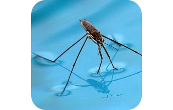|
| Zarigueya                                         |           |       | OK            |[Entre Sombras y Ramas 🌳🦝: La Vida Secreta de la Zarigüeya](https://youtu.be/1YqHXlGDYRQ) |  ||
| Zorro                                             | 1         |       |               | |           ||
| Zorro Polar (Zorro ártico)                        | 1         |       |               | |           ||

# Pendiente de revisar
-  https://animalia.bio/es/lists/parrots
-  https://animalia.bio/es/reptiles
-  https://seo.org/guia-de-aves/
- [Pedia de peces](https://www.fishipedia.es/#)
- [wiki de peces](https://www.peceswiki.com/)
- [Peces de agua dulce](https://laguiadelacuario.es/fichas-pecesaguadulce/)

# test
[info](https://www.miteco.gob.es/es/biodiversidad/temas/inventarios-nacionales/inventario-especies-terrestres/inventario-nacional-de-biodiversidad/ieet_mamif_atlas_indice_familias.html#artiodactilos)
|Animal|Source|
|---------|----------|
|Mamiferos||
|Sus scrofa. Jabalí|[info](https://www.miteco.gob.es/content/dam/miteco/es/biodiversidad/temas/inventarios-nacionales/ieet_mami_sus_scrofa_tcm30-99882.pdf)|
|Reptiles||
|Peces||
|Insectos||
