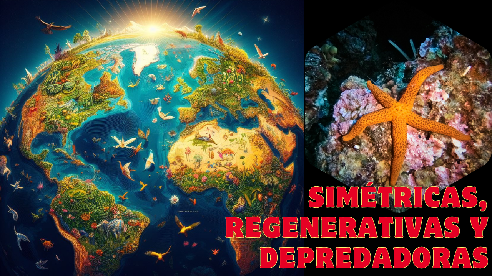

Prepárense para sumergirse en el misterioso mundo de una criatura fascinante. Imaginen un ser con una asombrosa simetría, capaz de regenerar partes perdidas de su cuerpo y con una forma que evoca las noches estrelladas bajo el océano. ¿Intrigados? Acompáñenme a descubrir todos los secretos de este increíble habitante de las profundidades.

# Anatomía Asombrosa de las Estrellas de Mar
Las estrellas de mar, conocidas científicamente como Asteroidea, despliegan una organización corporal radialmente simétrica, generalmente con cinco brazos que irradian desde un disco central en su etapa adulta. Esta simetría pentarradial es una de las características más distintivas de estos equinodermos. Sin embargo, se cree que sus ancestros evolutivos tenían simetría bilateral, y de hecho, las estrellas de mar, al igual que otros equinodermos, solo exhiben esta simetría bilateral en sus formas larvales. La naturaleza, en su infinita sabiduría, nos muestra que siempre hay excepciones a la regla. Varios grupos de asteroideos, como la familia Solasteridae, se apartan de la norma al poseer entre 10 y 15 brazos. Pero la verdadera campeona en diversidad de extremidades es la Labidiaster annulatus, una especie antártica que puede llegar a tener la asombrosa cantidad de ¡hasta 50 brazos! Incluso dentro de las especies de cinco brazos, no es raro encontrar individuos con seis o más extremidades, una peculiaridad derivada de anomalías en su desarrollo.
La superficie de las estrellas de mar está cubierta por una armadura de placas de carbonato de calcio, conocidas como osículos. Estas estructuras forman el endoesqueleto, que puede manifestarse externamente de diversas maneras, como espinas y gránulos. Estas formaciones no solo les brindan protección, sino que también se disponen en patrones y series características, cuya arquitectura, formas individuales y ubicaciones son herramientas clave para los científicos en la clasificación de los diferentes grupos dentro de la clase Asteroidea. La terminología utilizada para describir la ubicación de los componentes corporales de las estrellas de mar se basa generalmente en la relación de estos con la boca o el disco central.
En la parte inferior de cada brazo, las estrellas de mar poseen cientos de pequeños pies tubulares, estructuras multifuncionales que les permiten moverse, adherirse a las superficies, alimentarse y respirar. Los extremos de estos pies ambulacrales están adaptados como ventosas, proporcionándoles un agarre sorprendente que les permite aferrarse a las rocas incluso en las condiciones más turbulentas.

# Hogares Oceánicos de las Estrellas de Mar
Dado su naturaleza marina, las estrellas de mar habitan en diversos ambientes oceánicos. Desde las coloridas y vibrantes aguas de los arrecifes de coral hasta las oscuras y frías profundidades abisales, las estrellas de mar han logrado colonizar una amplia gama de hábitats marinos. Su adaptabilidad les permite prosperar tanto en zonas intermareales, expuestas a los cambios constantes de las mareas, como en lechos marinos profundos, donde la presión es extrema y la luz solar escasea. Esta capacidad de habitar diversos entornos subraya la notable plasticidad ecológica de estos equinodermos.

# Banquete Bajo el Mar: La Alimentación de las Estrellas de Mar
Las estrellas de mar son depredadoras voraces con una dieta variada que incluye mejillones, almejas, pequeños peces, caracoles y balanos. Su método de alimentación es particularmente fascinante: tienen la capacidad de extraer su estómago hacia afuera a través de la boca, realizando la digestión fuera de sus cuerpos. Esta increíble adaptación les permite consumir presas mucho más grandes de lo que su boca podría admitir normalmente. Imaginen a una estrella de mar acercándose a un mejillón; utilizando sus fuertes brazos y pies tubulares, ejerce presión sobre las valvas hasta que se abren ligeramente. Entonces, con una precisión sorprendente, everte su estómago e inserta este órgano digestivo dentro de la concha del mejillón, donde libera enzimas que descomponen los tejidos blandos de su presa. Una vez que la presa está parcialmente digerida, la estrella de mar retrae su estómago junto con el alimento semilíquido, completando así el proceso digestivo dentro de su cuerpo.

# El Ciclo de Vida de las Estrellas de Mar: Reproducción
La reproducción en las estrellas de mar se lleva a cabo principalmente mediante fecundación externa. Durante la época de reproducción, las estrellas de mar se congregan en grandes números, liberando simultáneamente sus gametos (espermatozoides y óvulos) al agua. Este proceso, conocido como desove, aumenta las probabilidades de que los óvulos sean fecundados. Los óvulos fecundados experimentan varias etapas larvarias planctónicas, durante las cuales las larvas, diminutas y transparentes, flotan a la deriva en las corrientes oceánicas, alimentándose de plancton y desarrollándose. Después de un período de tiempo variable, estas larvas sufren una metamorfosis transformadora, asentándose en el fondo marino y convirtiéndose en jóvenes estrellas de mar.
Sin embargo, la reproducción sexual no es la única forma en que las estrellas de mar pueden propagar su especie. Algunas especies también tienen la notable capacidad de reproducirse asexualmente por fragmentación. Este proceso ocurre cuando una estrella de mar se divide en dos o más partes, ya sea accidentalmente, debido a un depredador, o intencionalmente. Cada una de estas partes tiene el potencial de regenerar las partes perdidas de su cuerpo y convertirse en un individuo completamente nuevo. Esta asombrosa capacidad de regeneración es una de las características más distintivas de las estrellas de mar y les permite recuperarse de lesiones y sobrevivir en entornos desafiantes. Además, pueden regenerar cualquier parte de su cuerpo que hayan perdido, un fenómeno biológico que ha fascinado a los científicos durante siglos.

# Amenazas y Estrategias de Supervivencia de las Estrellas de Mar
El archivo no menciona específicamente los depredadores de las estrellas de mar ni sus mecanismos de defensa. Sin embargo, es sabido que las estrellas de mar enfrentan diversas amenazas en su entorno natural. Algunos de sus depredadores incluyen peces, aves marinas y nutrias de mar. Para protegerse, algunas especies han desarrollado espinas o placas calcáreas que les brindan una armadura natural. Su capacidad de regeneración también juega un papel crucial en su supervivencia, permitiéndoles escapar de depredadores al sacrificar un brazo, que luego regenerarán.

# Datos Curiosos del Mundo de las Estrellas de Mar
¿Sabías que las estrellas de mar pueden "ver"? Aunque no tienen ojos en el sentido tradicional, en la punta de cada uno de sus brazos poseen estructuras llamadas ocelos, que son zonas sensibles a la luz. Estos ocelos no les permiten ver imágenes nítidas, pero sí detectar cambios en la intensidad de la luz, lo que les ayuda a orientarse y a detectar la presencia de depredadores o presas. Es como si tuvieran pequeños ojos en sus dedos.
Pero la percepción sensorial de las estrellas de mar no se limita a la vista rudimentaria. También pueden "oler" gracias a quimiorreceptores distribuidos por la superficie de su cuerpo. Estos receptores les permiten detectar sustancias químicas disueltas en el agua, como las liberadas por sus presas, lo que les facilita la tarea de encontrarlas. Imaginen poder oler su comida a distancia, ¡una habilidad realmente útil para un depredador marino! Y por si fuera poco, las estrellas de mar también pueden "saborear" la salinidad del agua que las rodea, lo que les proporciona información valiosa sobre su entorno.
En ocasiones, cerca de los discos centrales de las estrellas de mar, podemos encontrarnos con ofiuras. Estas criaturas, a menudo confundidas con estrellas de mar, se distinguen fácilmente por sus brazos delgados, serpentiformes y bien definidos, que se mueven con una agilidad sorprendente. A diferencia de los brazos más robustos y fusionados en la base de las estrellas de mar, los brazos de las ofiuras son más largos y flexibles, lo que les permite desplazarse con rapidez y capturar presas con precisión.
También existen las clavelinas, pertenecientes a la clase Crinoidea, que comparten con las estrellas de mar y las ofiuras el filo Echinodermata. Sin embargo, las clavelinas se diferencian de sus parientes por tener brazos ramificados y plumosos, que utilizan para filtrar partículas de alimento del agua. Además, a diferencia de las estrellas de mar, que generalmente se desplazan sobre el fondo marino, las clavelinas suelen estar fijas al sustrato mediante un tallo o apéndices ventrales, llevando una existencia sésil o de movimiento muy limitado.

# Un Universo por Descubrir
Las estrellas de mar son mucho más que simples figuras marinas; son criaturas complejas con adaptaciones sorprendentes y un papel crucial en los ecosistemas oceánicos. Su capacidad de regeneración, su peculiar forma de alimentarse y sus "sentidos" rudimentarios nos abren una ventana a la increíble diversidad de la vida en nuestro planeta. Desde las profundidades abisales hasta los arrecifes de coral, estos equinodermos nos muestran la asombrosa variedad de formas y funciones que la evolución puede crear. Te invito a seguir explorando el fascinante mundo de las estrellas de mar y a maravillarse con cada nuevo descubrimiento. ¡No te pierdas nuestro próximo video, donde veremos a estas asombrosas criaturas en acción!