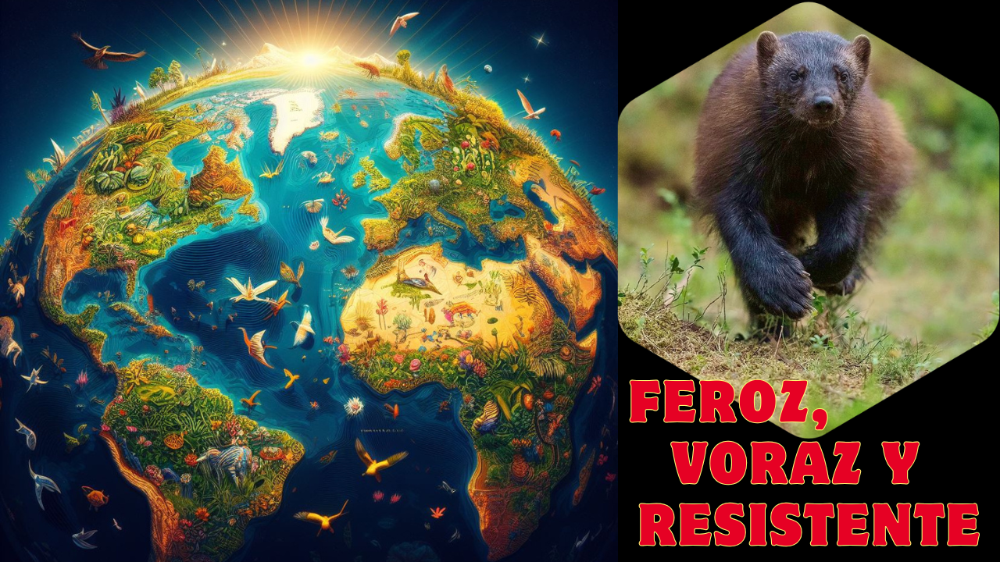

## El Depredador Imparable de las Regiones Frías

Imagina un animal con la fuerza de un oso, la agilidad de un felino y la ferocidad de un lobo, pero con un tamaño relativamente pequeño. A pesar de no ser el más grande de su entorno, este depredador es capaz de enfrentarse a presas mucho más grandes que él y defender su territorio con una tenacidad asombrosa. Su apariencia ruda y su carácter indomable lo han convertido en una verdadera leyenda en las regiones frías del hemisferio norte. ¿Sabes de quién hablamos?

### Anatomía: Pequeño pero Poderoso

El glotón (Gulo gulo), también conocido como carcayú, es un mamífero de la familia Mustelidae, caracterizado por su cuerpo compacto y musculoso. Su tamaño oscila entre los 65 y 105 centímetros de longitud, con un peso que varía entre los 12 y 18 kilogramos en los machos y entre 8 y 12 kilogramos en las hembras. Su grueso pelaje, de color marrón oscuro con una franja más clara en la espalda, le proporciona protección contra el frío extremo.

Este animal posee una piel excepcionalmente resistente que le ayuda a evitar heridas graves en combates con otros depredadores. Además, sus mandíbulas son increíblemente fuertes, lo que le permite triturar huesos con facilidad y aprovechar cada parte de sus presas. Sus garras afiladas no solo le sirven para cazar, sino también para trepar árboles y excavar madrigueras en la nieve.

### Hábitat y Distribución: Dueño del Frío

El glotón habita en las vastas extensiones de la tundra y la taiga boreal de Europa, Asia y América del Norte. Sus poblaciones más grandes se encuentran en Canadá, Alaska, Escandinavia y Rusia. Prefiere territorios boscosos y montañosos con abundante nieve, ya que esta le ofrece refugio y facilita su estilo de caza. En algunas regiones, su número ha disminuido debido a la fragmentación del hábitat y la caza, lo que ha llevado a que se le considere una especie en riesgo en ciertas áreas.

### Alimentación: Un Omnívoro Oportunista

El glotón es un depredador versátil y carroñero. Su dieta varía según la estación del año y la disponibilidad de alimento. En verano, se alimenta de pequeños mamíferos, aves, insectos, huevos y bayas. En invierno, cuando la comida escasea, se convierte en un formidable cazador de ungulados como renos, alces y ciervos, a los que ataca por sorpresa. También roba presas de otros depredadores como zorros y lobos, y no duda en aprovechar cualquier carroña que encuentre en su camino.

Su increíble fuerza le permite mover grandes rocas y troncos para acceder a su comida, y es capaz de consumir hasta el 15% de su peso corporal en un solo día. Gracias a su eficiente metabolismo, puede sobrevivir largos períodos sin alimentarse, almacenando energía en su gruesa capa de grasa.

### Reproducción: Una Crianza Solitaria

El glotón es un animal solitario y territorial, excepto durante la época de apareamiento, que ocurre entre junio y agosto. Las hembras dan a luz entre uno y cinco cachorros después de una gestación de aproximadamente 30 a 60 días. Las crías nacen ciegas, sordas y sin pelaje, por lo que dependen completamente de su madre durante los primeros meses de vida.

Las madrigueras donde nacen suelen excavarse en la nieve, proporcionando un refugio seguro contra los depredadores y el frío extremo. Los cachorros permanecen con la madre hasta los 10 meses de edad, aprendiendo a cazar y a sobrevivir en un entorno hostil. La madurez sexual se alcanza a los dos años, momento en el cual los jóvenes glotones buscan su propio territorio.

### Depredadores y Defensa: Un Guerrero Indomable

A pesar de su ferocidad, el glotón tiene algunos enemigos naturales. Lobos, pumas, osos pardos y águilas reales pueden representar una amenaza, especialmente para los individuos más jóvenes o debilitados. Sin embargo, este mustélido no se deja intimidar fácilmente y es capaz de enfrentarse a adversarios mucho más grandes con una valentía impresionante.

Su estrategia de defensa incluye el uso de su potente mordida y su piel gruesa, que reduce el impacto de los ataques. Además, posee glándulas anales que pueden liberar un olor desagradable para ahuyentar a posibles depredadores, similar al mecanismo de defensa de las mofetas.

### Datos Curiosos: Más Sorprendente de lo que Parece

A pesar de su aspecto robusto, es un excelente trepador y nadador, lo que le permite moverse con agilidad en su entorno. Su nombre científico, Gulo gulo, proviene del latín y significa "glotón", haciendo referencia a su gran apetito. Además, este mustélido es muy territorial y puede enfrentarse incluso a osos y lobos para defender su espacio. 

### Conclusión: El Espíritu del Bosque Boreal

El glotón es un animal extraordinario, capaz de sobrevivir en condiciones extremas gracias a su fuerza, adaptabilidad y tenacidad. Aunque no es muy conocido, su papel en los ecosistemas boreales es fundamental, ya que ayuda a mantener el equilibrio natural al controlar poblaciones de presas y reciclar materia orgánica como carroñero.

Si quieres conocer más sobre este impresionante depredador, no te pierdas nuestro próximo video, donde exploraremos imágenes y datos impactantes sobre el glotón en su hábitat natural. ¡Suscríbete y sigue descubriendo el asombroso mundo de la fauna salvaje!