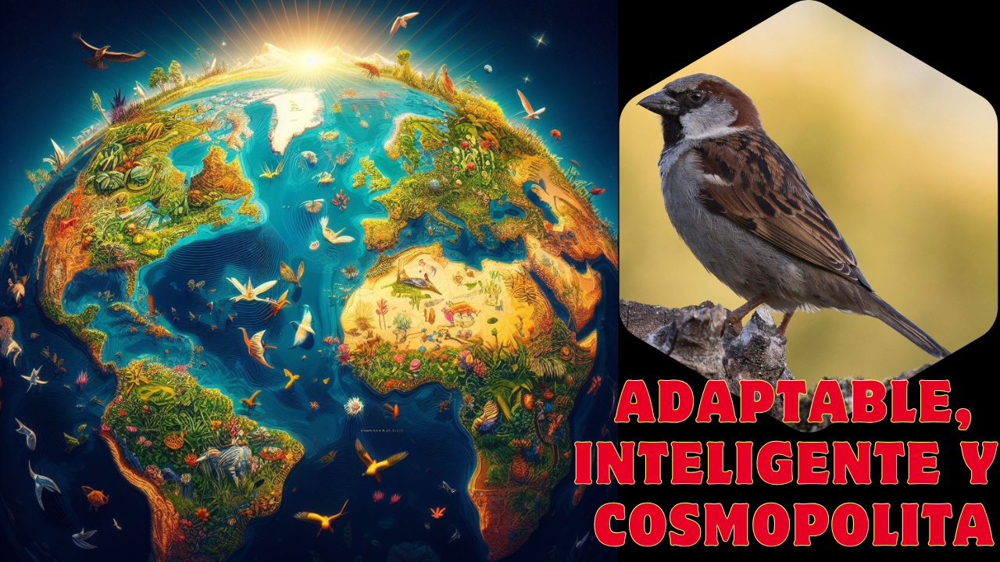

# 🐦 El VECINO más COMÚN del que NO SABES NADA 🤫

Piensa en el pájaro más común que ves cada día. Ese que te encuentras en parques, terrazas y calles, tan familiar que a menudo pasa desapercibido. Pero, ¿qué sabes realmente de él? Imagina un ave que ha conquistado el mundo siguiendo nuestros pasos, un superviviente nato con una inteligencia que subestimamos. Quédate con nosotros para redescubrir a este compañero inseparable de la humanidad. Hoy exploraremos los secretos del gorrión común, conocido científicamente como Passer domesticus, un animal cuya historia y habilidades te dejarán asombrado.

## Anatomía y Apariencia

A primera vista, el gorrión común es un ave pequeña y robusta, de aspecto rechoncho. Mide unos 15 centímetros y su plumaje parece modesto, pero los detalles marcan la diferencia. Su pico es corto y fuerte, perfecto para romper semillas. Lo más interesante es que machos y hembras no son iguales. El macho luce una coronilla gris, mejillas blancas y un inconfundible "babero" negro en la garganta y el pecho, que se hace más grande y vistoso en la época de cría. La hembra, en cambio, es más discreta, de tonos pardos y grisáceos, con una ceja de color crema pálido que le da una expresión distintiva. Su constante y alegre gorjeo es la banda sonora de nuestras ciudades.

## Hábitat y Distribución

Gracias a su increíble capacidad de adaptación, el gorrión común es una de las aves más cosmopolitas del planeta. Originario de Eurasia y el norte de África, ha acompañado al ser humano en su expansión, siendo introducido voluntaria o accidentalmente en todos los continentes excepto la Antártida. Es un ave "antropófila", lo que significa que su vida está ligada a la nuestra. Prospera en cualquier lugar donde haya gente: desde el corazón de las metrópolis hasta granjas y pueblos remotos. Sin embargo, evita los bosques densos, las selvas y los desiertos, demostrando que su verdadero ecosistema somos nosotros.

## Dieta y Alimentación

Los gorriones comunes son los reyes del oportunismo. Su dieta es principalmente granívora, basada en semillas de hierbas y cereales. Sin embargo, su éxito se debe a su flexibilidad para comer casi cualquier cosa. En las ciudades, se han convertido en expertos buscadores de restos de comida, migas de pan y cualquier desperdicio que dejemos a nuestro paso. En el campo, no dudan en visitar granjas para alimentarse del pienso del ganado. Durante la primavera, cazan activamente insectos y larvas, un alimento rico en proteínas que es esencial para sacar adelante a sus polluelos.

## Reproducción y Ciclo de Vida

El gorrión común es un reproductor prolífico. Las parejas son monógamas y a menudo permanecen juntas de por vida, criando varias nidadas al año. Son famosos por su poca exigencia a la hora de anidar. Un gorrión puede construir su nido en casi cualquier hueco: bajo una teja, en una grieta de un muro, en el letrero de una tienda o incluso dentro de farolas. El nido es una estructura esférica y desordenada hecha de hierba seca, plumas, hilos y hasta trozos de plástico. La hembra pone de 4 a 6 huevos, que son incubados por ambos padres durante unos 12-14 días. Los polluelos son alimentados por sus dos progenitores hasta que están listos para volar.

## Rivales y Desafíos

En la ciudad, su principal depredador es el gato doméstico, aunque también son presa de aves rapaces como el cernícalo o el gavilán. Sin embargo, su mayor desafío actual es paradójicamente la vida moderna. Aunque parezcan innumerables, en muchas grandes ciudades de Europa sus poblaciones han disminuido drásticamente. La arquitectura moderna, con sus fachadas lisas y sin huecos, les ofrece menos sitios para anidar. Además, la mayor limpieza urbana y el uso de pesticidas reducen la disponibilidad de alimentos, sobre todo de los insectos que necesitan sus crías para sobrevivir.

## Comportamiento Sorprendente

Ahora, prepárate para ver al gorrión con otros ojos. Lejos de ser un simple pajarillo, es un animal increíblemente inteligente y con una gran capacidad de aprendizaje. 🧠 Se ha observado a gorriones aprendiendo a abrir las puertas automáticas de los supermercados para entrar a buscar comida, o siguiendo a los repartidores de pan para saber dónde encontrar migas frescas. Son extremadamente sociales y curiosos. Una de sus conductas más conocidas son los "baños de polvo": se revuelcan en grupo en la tierra seca para limpiar su plumaje y deshacerse de parásitos, en un ritual lleno de energía y gorjeos.

## ¿Un Gorrión sin más?

Este pájaro es mucho más que "un gorrión". Es el gorrión por excelencia, el que da nombre a toda una familia de aves, los Paséridos. No debe confundirse con los "gorriones" americanos, que pertenecen a una familia completamente diferente. Su historia está ligada a la de la agricultura. Los científicos creen que el gorrión común evolucionó junto a las primeras comunidades agrícolas de Oriente Medio, adaptándose a comer los granos cultivados y almacenados. Desde entonces, ha sido nuestro inseparable compañero de viaje, un testigo alado del desarrollo de nuestra civilización.

## Comunicación y Vida Social ❤️

El "chip-chip" del gorrión es más complejo de lo que parece. Utilizan diferentes tipos y secuencias de llamadas para comunicarse. Un gorjeo puede servir para mantener el contacto con el grupo, otro para advertir de un peligro (como un gato cercano) y otros más elaborados son parte del cortejo del macho. Viven en bandadas jerarquizadas, sobre todo fuera de la época de cría. Dentro del grupo, el tamaño del babero negro del macho es una señal de estatus: cuanto más grande y oscuro, más dominante es el individuo, teniendo prioridad para acceder al alimento y a las hembras.

El gorrión común, un animal con una historia de éxito global, lleno de ingenio y con una asombrosa capacidad para vivir entre nosotros. Desde su papel como humilde recolector de semillas hasta su estatus como maestro de la supervivencia urbana, el Passer domesticus es un ejemplo de adaptación. Esperamos que este viaje por su mundo te haya parecido revelador. Te invitamos a que la próxima vez que veas a uno, te detengas un segundo a observar a este extraordinario vecino. ¡No te pierdas nuestras próximas aventuras en el fascinante mundo animal
