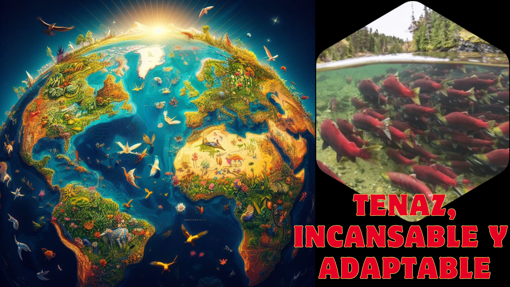

### El Viajero Incansable de Dos Mundos

Imagina un ser vivo que nace en la tranquilidad de un río, se aventura a la inmensidad del océano para alcanzar su plenitud y, contra todo pronóstico, emprende un épico viaje de regreso al mismo punto donde su vida comenzó. No come durante meses, transforma su cuerpo y desafía corrientes y depredadores, todo por un único propósito: asegurar el futuro de su especie. Este atleta de la naturaleza, este navegante de instintos ancestrales, es el salmón.

### Anatomía: Un Diseño para la Resistencia

El cuerpo del salmón es una obra maestra de hidrodinámica. Alargado y fusiforme, está cubierto por pequeñas escamas que, cuando nada en mar abierto, brillan con un tono plateado que lo camufla entre las corrientes. Su longitud suele oscilar entre 60 y 100 cm, y su cabeza, relativamente pequeña, alberga mandíbulas potentes. Destaca también su aleta adiposa, una pequeña aleta carnosa situada en el lomo, cerca de la cola, típica de su familia. Su cola, poderosa y flexible, actúa como motor natural que le permite recorrer largas distancias migratorias y realizar saltos espectaculares de varios metros de altura para superar cascadas y otros obstáculos en su camino río arriba.

### Hábitat y Distribución: Un Ciudadano del Hemisferio Norte

El salmón es un pez de aguas frías y bien oxigenadas, lo que define su distribución global. Habita en los océanos Atlántico y Pacífico. Especies como el salmón del Atlántico, cuyo nombre científico es Salmo salar, se encuentran en las costas de Norteamérica y Europa. Por otro lado, la cuenca del Pacífico es el hogar de varias especies del género Oncorhynchus, con poblaciones clave en las costas de Alaska, Canadá y Rusia. Su vida transcurre en dos hábitats radicalmente distintos: los ríos y lagos de agua dulce, donde nacen y se reproducen, y el océano de agua salada, donde crecen y maduran.

### Alimentación: Una Dieta que Cambia con el Viaje

La dieta del salmón varía drásticamente a lo largo de su vida. En su etapa juvenil en los ríos, se alimenta de insectos, plancton e invertebrados. Una vez que migra al océano, su menú se expande y se vuelve un depredador oportunista, consumiendo peces más pequeños como arenques, y diversos crustáceos como el krill. De hecho, son estos crustáceos, ricos en pigmentos carotenoides, los que le otorgan a su carne el característico color rosado o rojizo. Curiosamente, durante su agotadora migración de regreso al río para desovar, el salmón adulto deja de alimentarse por completo.

### Reproducción: La Misión Final

El ciclo reproductivo del salmón es una de las migraciones más extremas del reino animal. Tras pasar de uno a cuatro años en el mar, un instinto irrefrenable los guía de vuelta a su río natal, en un fenómeno conocido como "homing". Se cree que utilizan una combinación de su agudo sentido del olfato para reconocer la "química" específica de su río y una especie de mapa magnético interno para orientarse en el vasto océano.

Al entrar en agua dulce, sus cuerpos sufren una transformación asombrosa: el brillante plateado se torna en tonos rojizos o verdosos, y los machos de muchas especies desarrollan una mandíbula ganchuda y una joroba prominente. La hembra excava un nido en la grava del lecho del río, donde deposita miles de huevos que el macho dominante fertiliza. Para la mayoría de las especies de salmón del Pacífico, este acto reproductivo es el final de sus vidas; sus cuerpos sin vida aportan nutrientes vitales al ecosistema fluvial, que servirán de alimento para sus futuras crías.

### Depredadores y Defensa: Una Lucha Constante

A lo largo de toda su vida, el salmón se enfrenta a una multitud de depredadores. En los ríos, los alevines son presa de otros peces y aves. En el océano, la amenaza proviene de tiburones, atunes, focas y orcas. Sin embargo, es durante su regreso al río cuando el espectáculo de la depredación se vuelve más dramático. Osos grizzly se congregan en las orillas de los ríos y en las cascadas, esperando para atrapar a los exhaustos peces que saltan contra la corriente. Las nutrias también son hábiles cazadoras, y se ha demostrado que los salmones pueden detectar la presencia de sus heces en el agua y evitar esas zonas.

### Datos Curiosos

El salmón es uno de los pocos animales capaces de vivir tanto en agua dulce como en agua salada, un rasgo conocido como anadromía. Este cambio de ambiente requiere una asombrosa adaptación fisiológica llamada esmoltificación, donde su cuerpo se reconfigura para poder procesar la sal del agua de mar.

Su capacidad de navegación es legendaria. Pueden recorrer distancias de más de 6000 kilómetros desde sus zonas de alimentación en el océano, como las costas de Groenlandia, para encontrar con una precisión asombrosa el mismo río donde nacieron años atrás. Su potencia no es menor, ya que su musculosa cola les permite alcanzar velocidades de nado de hasta 50 kilómetros por hora en ráfagas cortas.

Aunque parezca increíble, el cuerpo sin vida de un salmón tras el desove juega un papel ecológico crucial. Al descomponerse, libera nutrientes de origen marino en los ecosistemas de agua dulce, que de otro modo serían pobres en ellos. Este acto final fertiliza el río y proporciona el primer alimento a los insectos y crustáceos que, a su vez, alimentarán a la siguiente generación de salmones.

Esperamos que este viaje por la vida del salmón te haya fascinado tanto como a nosotros. Es solo una muestra de la increíble fauna que habita nuestro planeta. Si quieres seguir descubriendo las maravillas del mundo animal, no olvides suscribirte a nuestro canal.